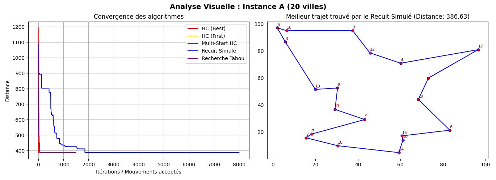
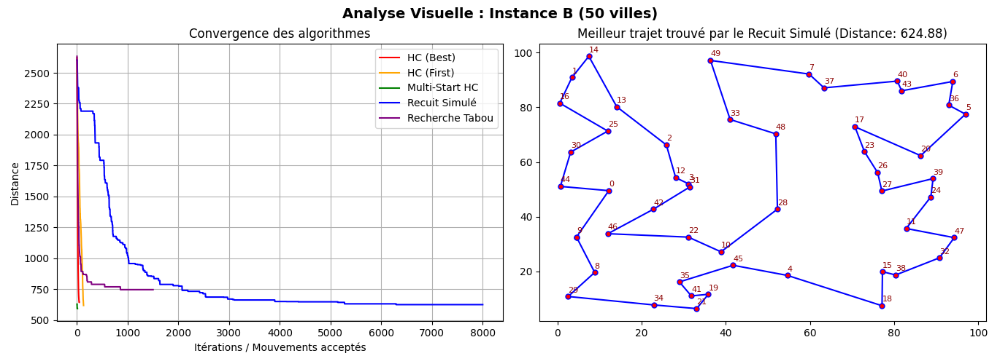

# 🌍 Projet M1 : Comparaison de Métaheuristiques pour le TSP

**Université Hassan II de Casablanca - ENSET Mohammedia** **Master :** SDIA (Sciences des Données et Intelligence Artificielle)

**Module :** Optimisation & Métaheuristiques

**Encadrant :** Prof. MESTARI

## 👥 Réalisé par :

* **Timourti Sana**
* **Misbah Kaoutar**
* **Essayouti Atiqa**

---

## 📝 Description du Projet

Ce projet vise à résoudre le célèbre **Problème du Voyageur de Commerce (TSP)** en comparant cinq approches d'optimisation basées sur l'opérateur de voisinage **2-opt** :

1. 🏔️ **Hill Climbing (Best Improvement)** : Une méthode de recherche locale intensive cherchant le meilleur voisin.
2. 🏔️ **Hill Climbing (First Improvement)** : Une variante plus rapide qui accepte la première solution voisine améliorante.
3. 🔄 **Multi-Start Hill Climbing** : Une amélioration du Hill Climbing qui relance la recherche depuis plusieurs points de départ aléatoires pour éviter les optimums locaux.
4. 🔥 **Recuit Simulé (Simulated Annealing)** : Une métaheuristique capable d'échapper aux optimums locaux en acceptant temporairement de moins bonnes solutions.
5. 🧠 **Recherche Tabou (Tabu Search)** : Une métaheuristique utilisant une mémoire (liste Tabou) pour empêcher le retour vers des solutions récemment explorées.

L'objectif est d'analyser leur performance et leur temps de convergence sur des instances de 20 et 50 villes.

---

## 📊 Résultats Clés (Exemple Instance 50 Villes)

Nos expérimentations montrent que les métaheuristiques (Recuit Simulé, Tabou) et le Multi-Start sont nettement supérieurs au Hill Climbing classique pour les grandes instances :

| Algorithme | Meilleur Coût (Distance) | Temps d'exécution |
| --- | --- | --- |
| **Hill Climbing (Best)** | ~ 1495.21 | ~ 0.44s |
| **Hill Climbing (First)** | *Rapide mais local* | *Très rapide* |
| **Multi-Start HC** | *Meilleur que HC simple* | *Variable* |
| **Recherche Tabou** | *Très compétitif* | *Variable* |
| **Recuit Simulé** | **~ 784.40** 🏆 | ~ 0.47s |

> **Analyse :** Le Hill Climbing stagne rapidement dans un optimum local. Le Multi-Start aide à corriger cela en relançant la recherche, tandis que le Recuit Simulé et la Recherche Tabou surpassent les autres en explorant l'espace de recherche plus intelligemment et en évitant les blocages prématurés.

---

## 📈 Courbes de Convergence et Trajets

Les graphiques ci-dessous montrent l'évolution de la distance totale au fil des itérations pour chaque algorithme, ainsi que le meilleur trajet trouvé.

### 🔹 Instance A (20 Villes)


### 🔹 Instance B (50 Villes)

## ⚙️ Installation et Exécution

**1️⃣ Cloner le projet**

```bash
git clone https://github.com/Ka-outar/TSP-Metaheuristics-Project.git
cd TSP-Metaheuristics-Project

```

**2️⃣ Installer les dépendances**

```bash
pip install numpy matplotlib

```

**3️⃣ Lancer l'analyse complète**

```bash
python main.py

```
